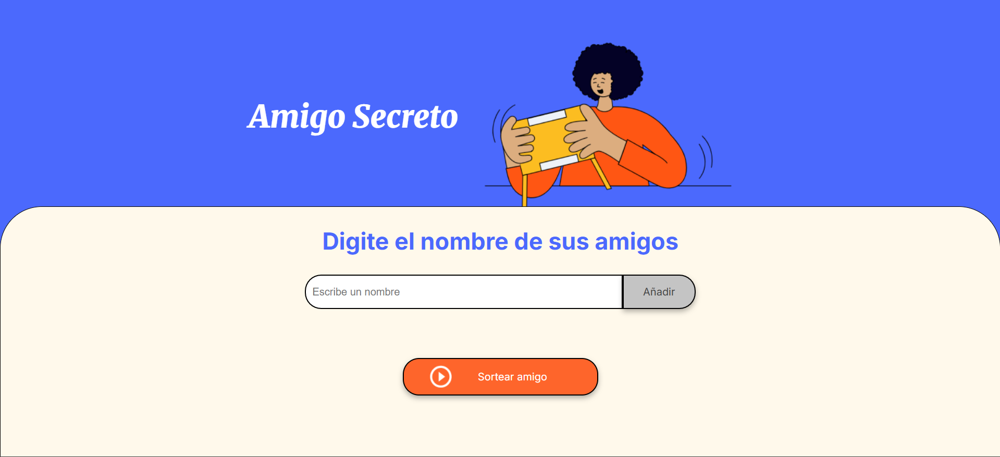

# Amigo Secreto

Este es un pequeño proyecto web que permite realizar un sorteo de "Amigo Secreto" ingresando nombres en una lista y seleccionando aleatoriamente un ganador.

## Características

- Agregar nombres a la lista.
- Validar que no se agreguen nombres vacíos o repetidos.
- Visualizar la lista de participantes.
- Realizar un sorteo aleatorio.
- Limpiar la lista después del sorteo.

## Tecnologías utilizadas

- **HTML** → Estructura del proyecto.
- **CSS** → Estilos y diseño.
- **JavaScript** → Lógica del sorteo.

## 📷 Vista previa



## Instalación y ejecución

1. **Clonar el repositorio**  
   ```bash
   https://github.com/Myrian-Rosmery/amigo-secreto.git
